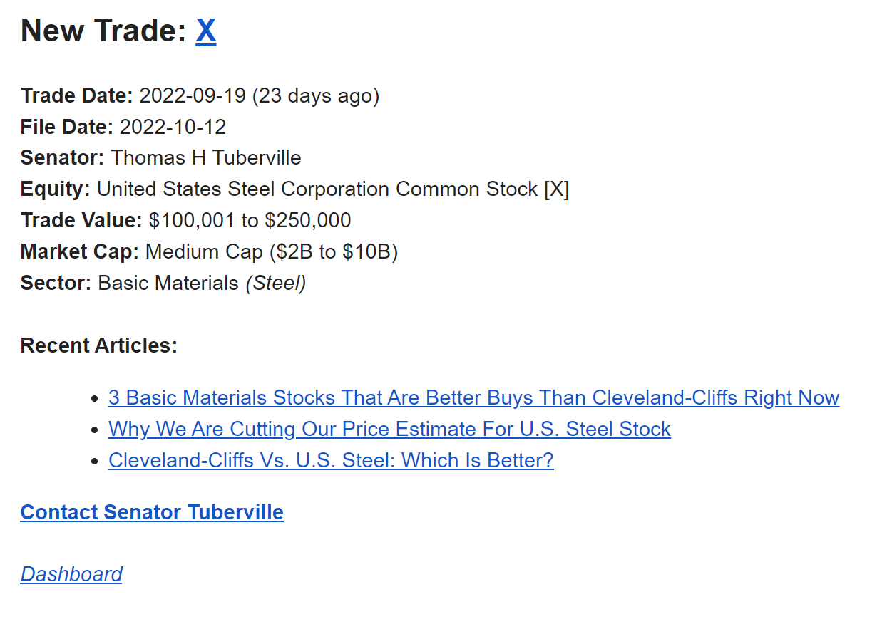
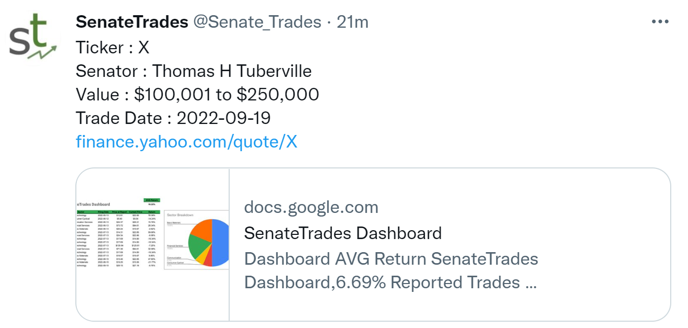

# :money_with_wings: Welcome to SenateTrades! :money_with_wings: #

<b>SenateTrades</b> is a free service that tracks the equity trading activity of US senators and sends automated alerts whenever a particularly interesting trade occurs.

# :high_brightness: Frequently Visited :high_brightness: #

- <b>[Newsletter Signup Form](https://docs.google.com/forms/d/e/1FAIpQLScnSVtK0tDMzJJEuNwqXYTuMK2RWexg0pDT3X9ZJiQHW6beeQ/viewform?usp=sf_link)</b> :email:
- <b>[Twitter](https://twitter.com/Senate_Trades)</b> :mega:
- <b>[Dashboard](https://docs.google.com/spreadsheets/d/14eg98rZU5Rza-MeUQMQJAaJD90Iz4OwTniB5Pd4vrzE/edit#gid=0)</b> :bar_chart:
- <b>[Question & Suggestion Form](https://docs.google.com/forms/d/e/1FAIpQLSdivz9xjREirrWGmRUgVr6tBCtvoEJNF3Y0gkihADa0cpyaBg/viewform?usp=sf_link)</b> :postbox:

# :thought_balloon: Most-Asked :thought_balloon: #

## :key: <b>What's the Point?</b> ##

    Throughout 2022, a Republican Senator representing Alabama has accumulated hundreds of thousands of dollars worth of stock in a small e-commerce company. A few weeks after all of these trades settled, this company announced it was being acquired in a deal that would increase its stock value by 50% in a matter of minutes, making a representative of one of the poorest states in the nation more money than nearly all of his constituents make in a year. Sure, you could chalk these returns up to luck, but this isn't an isolated incident. Senators from all over the nation are consistently making trades in the stock market, and many of these appear to have possibly been made upon material information - something we at <b>SenateTrades</b> think is fundamentally wrong, and unfair to constituents.

    <b>SenateTrades</b> is a service for investors and politically-minded people who think it’s unfair for US congress members to solely reap the benefits of stock trading with political connections. Any time a senator makes a particularly interesting trade, our service automatically sends a detailed and digestible email newsletter once the trade is published. These alerts are also published to our <a href="https://twitter.com/Senate_Trades">Twitter</a>, and archived in our <a href="https://docs.google.com/spreadsheets/d/14eg98rZU5Rza-MeUQMQJAaJD90Iz4OwTniB5Pd4vrzE/edit#gid=0">Dashboard</a>.

    This allows users to easily gain insight into what their senators are buying, without being overwhelmed by a mountain of financial information. This kickstarts you to perform further research, stay politically informed, sharpen your understanding of financial markets, or even make the trade yourself. At <b>SenateTrades</b>, we think its time for you to get a piece of the pie for yourself. 

## :floppy_disk: <b>How's it Work?</b> ##

    This project tracks stock market trading activity of US senators by scraping the <a href="https://sec.report/Senate-Stock-Disclosures">SEC EDGAR Insider Trading Disclosures List</a> multiple times each hour for the most up-to-date information, and looks for any and all trades published that day. A <i>particularly interesting trade</i> is defined as any purchase of common stock where:
    <ul style="list-style-type:square">
        <li>The company is small (market cap <$2B)</li>
        <li>The purchase is worth over $100,000, regardless of company size</li>
        <li>The company is medium sized (market cap between $2B and $10B), and the purchase is worth at least $50,000</li>
    </ul>
    Once an interesting trade is found, an email alert is automatically dispatched, along with a tweet on our <a href="https://twitter.com/Senate_Trades">Twitter Page</a>, and an entry in our <a href="https://docs.google.com/spreadsheets/d/14eg98rZU5Rza-MeUQMQJAaJD90Iz4OwTniB5Pd4vrzE/edit#gid=0">Dashboard</a>.

## :mailbox: <b>What Do Alerts Look Like?</b> ##

    Email alerts are meant to provide you with as much helpful information as possible - while still remaining digestible. These also contain helpful links to continue your research and stay politically active, including:
    <ul style="list-style-type:square">
        <li>A link to the stock's <a href="https://finance.yahoo.com/">Yahoo! Finance</a> page embedded in the ticker in the header</li>
        <li>Up to 3 of the most recent and relevant news articles about the company</li>
        <li>A link to the contact page of the senator who made the trade</li>
        <li>A link to our a <a href="https://docs.google.com/spreadsheets/d/14eg98rZU5Rza-MeUQMQJAaJD90Iz4OwTniB5Pd4vrzE/edit#gid=0">Dashboard</a></li>
    </ul>

Here is a sample of an email alert

  
And a tweet!  

Credit to Jie Jenn for his Gmail and Google Sheets API scripts, especially his [Google.py](/main/Google.py) file.

